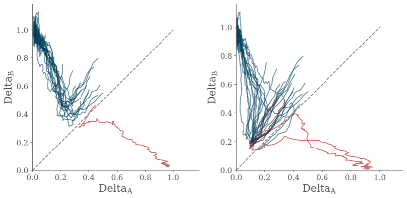
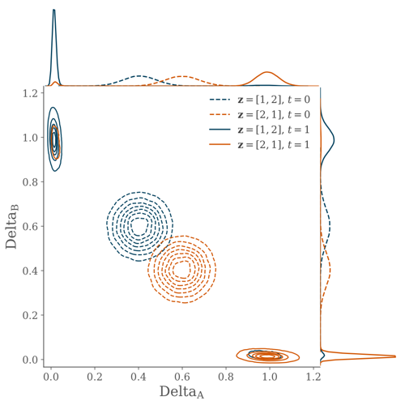
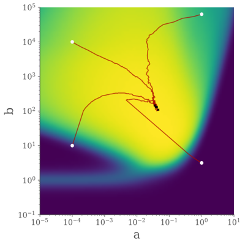

#  Delta-Notch Signalling and Positional Inference.

This is the repo containing code for a section of the final chapter of my thesis which uses a simple model of cell-cell communication, known as Delta-Notch signalling to demonstrate concretely how local interactions between cells can improve their positional inference (or, in other words, how it can improve the coordination between the internal state of a cell and its position).

A simple two-cell model is used to illustrate the link between maximum-likelihood inference of position and the dynamical features of a gene-regulatory network.

The parameters of the SDE are then optimised with respect to the system's performance on the patterning problem. This uses the autodiff functionality of [Jax](https://github.com/google/jax) so take gradients through the (somewhat complex) objective function and subsequently the SDE solver.

The Delta-Notch system is modelled using the equations of Collier et al. (1996) which form the basis of the stochastic differential equations. 

The code uses the jax-based SDE solvers from [xwinxu/bayeSDE](https://github.com/xwinxu/bayeSDE).

### Disclaimer
This repo has become a bit messy during the somewhat hectic final stages of writing my thesis. It will be repaired shortly.

### TODO
While sde solvers in the bayeSDE repo have worked well, ideally this code would now be converted to a more fully fledged Jax-based differential equation library such as [patrick-kidger/diffrax](https://github.com/patrick-kidger/diffrax).
